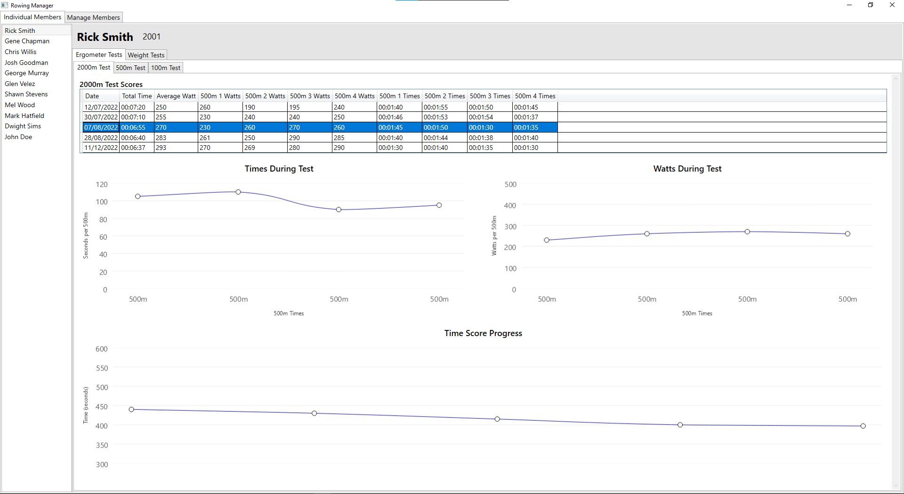
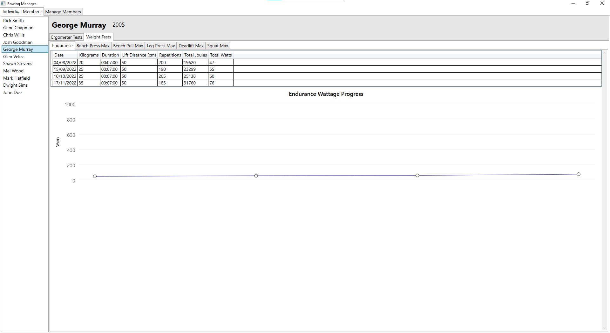
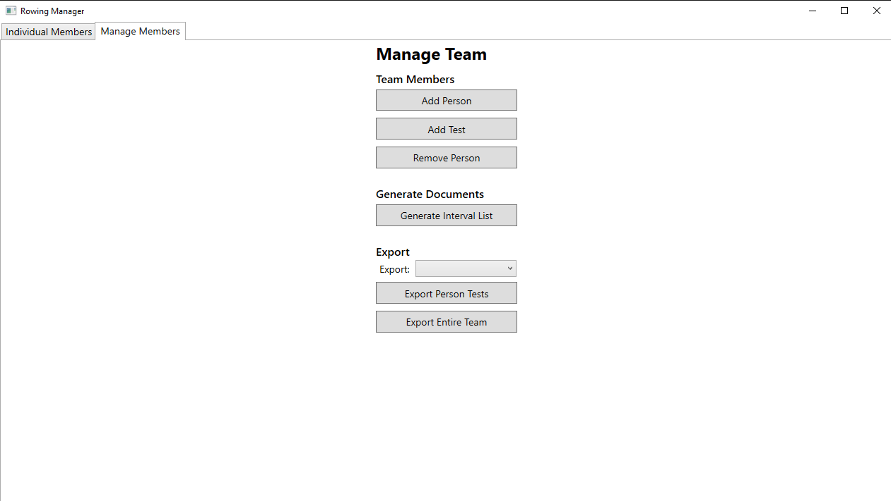
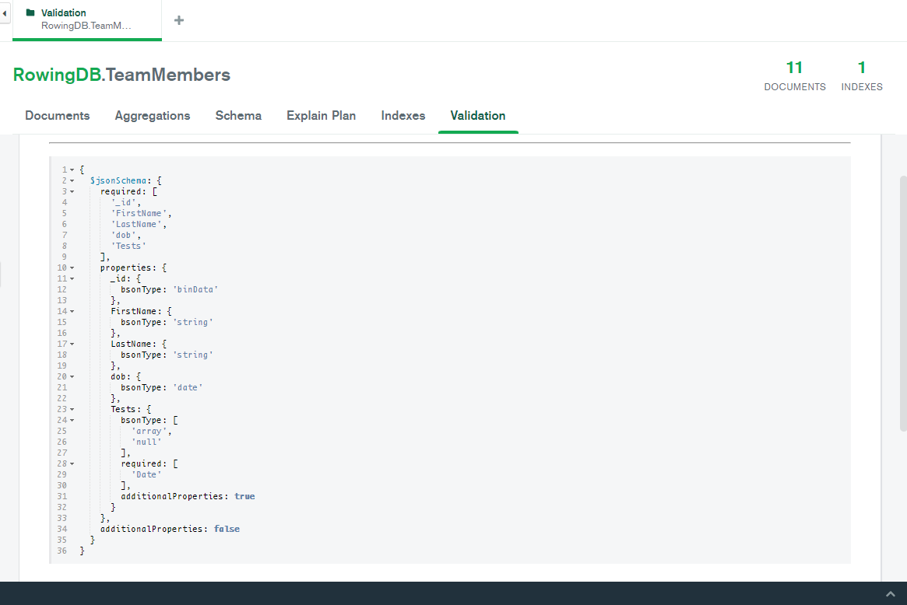

# Rowing Team Tracker and Manager - IB Computer Science HL Internal Assessment M23

This repository contains the source code for my Internal Assessment for IB Computer
Science at Higher Level. I submitted this IA during the M23 session and received
a 7 for CS HL, however I'm not sure how significantly the IA impacted that result.

The application is designed to provide a convenient method of managing, tracking,
and logging the performance of team members in a rowing team. It allows the user to
add and remove members, add data points to them which can be visually plotted, and
finally export member/team data to Word .docx files. This was developed in C# using
the Windows Presentation Foundation (WPF) library,so it is only compatiable with
Microsoft Windows, however if a different UI framework were to be used it could
theoretically be possible to support any OS.
<p align="center"></p>


## The Design
The application was written in C# using VS2022. The [Model-View-ViewModel (MVVM)](https://en.wikipedia.org/wiki/Model%E2%80%93view%E2%80%93viewmodel)
design pattern was used and implemented using the WPF framework. Below a detailed UML diagram describes
how all the source code elements are linked together:


### MongoDB Setup
Data storage is handled by MongoDB where the following validation schema is used and can
be found in `mongodb_validation.json`. The program expects MongoDB to be running in the
background with a database called `RowingDB` with a collection called `TeamMembers`.
```
{ $jsonSchema: {
    required: ['_id', 'FirstName', 'LastName', 'dob', 'Tests'],
    properties: {
      _id: { bsonType: 'binData' },
      FirstName: { bsonType: 'string' },
      LastName: { bsonType: 'string' },
      dob: { bsonType: 'date' },
      Tests: {
        bsonType: ['array', 'null'],
        required: ['Date'],
        additionalProperties: true
      }
    },
    additionalProperties: false
  }
}
```
Here is a screenshot of where to place this in MongoDB:


## Building and Running
The VS2022 solution can be opened from the `src/RowingManager.sln` file, then the project can be built.
Alternatively the zip folder containing the combiled binaries can be downloaded from the releases page
of this repository. The following libraries were used and can be installed using NuGet:
- [Caliburn.Micro](https://www.nuget.org/packages/Caliburn.Micro) - MVVM framework
- [DocX](https://www.nuget.org/packages/DocX) - .docx document generator
- [Extended.Wpf.Toolkit](https://www.nuget.org/packages/Extended.Wpf.Toolkit) - extra wpf widgets
- [LiveChartsCore.SkiaSharpView.WPF](https://www.nuget.org/packages/LiveChartsCore.SkiaSharpView.WPF/2.0.0-beta.920) - plotting and graphs
- [MongoDB.Driver](https://www.nuget.org/packages/MongoDB.Driver) - mongodb interface

This list can be found in `RowingManager.csproj`
```xml
<PackageReference Include="Caliburn.Micro" Version="4.0.212" />
<PackageReference Include="DocX" Version="2.4.0" />
<PackageReference Include="Extended.Wpf.Toolkit" Version="4.5.0" />
<PackageReference Include="LiveChartsCore.SkiaSharpView.WPF" Version="2.0.0-beta.602" />
<PackageReference Include="MongoDB.Driver" Version="2.18.0" />
```

## References
I recommend the following resources for learning about WPF MVVM using Caliburn Micro, and MongoDB:
- https://www.youtube.com/watch?v=laPFq3Fhs8k
- https://www.youtube.com/watch?v=69WBy4MHYUw
